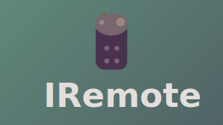

# IRemote

## Contributing
Issues and PRs are welcome (would maybe consider having a wiki for common importable configurations)

## Installation
**Option 1**: Direct APK download from github using Downloader app by AFTV, or any other web broswer. 

**Option 2**: Share through localsend (or send files to tv).

## License
See [LICENSE](LICENSE) file for details.
